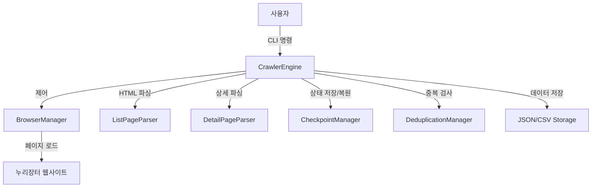

# 누리장터 크롤러 설계 문서 (Design Document)

## 1. 시스템 개요 (Overview)

본 시스템은 **누리장터(https://nuri.g2b.go.kr)** 입찰공고 데이터를 수집하기 위한 자동화 크롤러입니다. 웹사이트의 WebSquare 기반 SPA(Single Page Application) 구조를 처리하며, 목록 페이지에서 상세 정보를 추출하고, 필요시 모달 및 팝업을 탐색하여 심층적인 데이터(Deep Crawling)를 수집합니다.

## 2. 아키텍처 (Architecture)

시스템은 모듈화된 계층 구조를 따르며, 각 컴포넌트는 독립적인 책임을 가집니다.

## 3. 핵심 컴포넌트

### 3.1. CrawlerEngine (`src/crawler/engine.py`)
- **역할**: 전체 크롤링 흐름을 제어하는 오케스트레이터.
- **주요 기능**:
    - `run()`: 메인 크롤링 루프 실행 (페이지네이션 처리).
    - `_fetch_detail_page()`: 상세 페이지 진입 및 데이터 병합.
    - `retry_failed_items()`: 실패한 항목 재시도 로직.
    - `_handle_nurijangter_spa()`: SPA 상태 초기화 및 네비게이션 복구.

### 3.2. BrowserManager (`src/crawler/browser.py`)
- **역할**: Playwright 브라우저 인스턴스 관리.
- **특징**: 컨텍스트 매니저(`with`) 지원, 헤드리스 모드 설정.

### 3.3. Parsers (`src/parser/`)
- **ListPageParser**: 목록 테이블 파싱, `BidNotice` 기본 객체 생성.
- **DetailPageParser**: 복잡한 HTML 구조 파싱. 3가지 전략 사용:
    1. **XPath**: 특정 경로의 데이터 직접 추출.
    2. **Table Iteration**: `TH`-`TD` 쌍을 순회하며 키-값 매핑.
    3. **Label Detection**: 라벨 텍스트 기반 인접 요소 추출.
    - **Deep Crawling**: `extract_contact_popup()`을 통해 담당자 팝업 데이터 추출.

### 3.4. State Management (`src/checkpoint/`, `src/deduplication/`)
- **CheckpointManager**: 진행 상황과 실패 목록을 `crawler_checkpoint.json`에 저장. 중단 시 재개 가능.
- **DeduplicationManager**: 공고번호+공고명 해시를 기반으로 중복 수집 방지 (`seen_items.json`).

## 4. 주요 흐름 (Key Workflows)

### 4.1. 일반 크롤링 (Normal Crawl)
1. 목록 페이지 로드 및 파싱.
2. 각 공고에 대해 중복 여부 확인.
3. 신규 공고일 경우 상세 페이지로 이동 (In-Page Navigation).
4. 공고 상세, 공고일반 모달, 담당자 팝업 순으로 데이터 수집.
5. 데이터 병합 및 저장.

### 4.2. 심층 크롤링 (Deep Crawl)
연락처 정보 등 깊이 숨겨진 데이터를 수집하기 위함.
1. **상세 페이지**: 기본 정보 수집.
2. **공고상세 모달**: '공고상세' 버튼 클릭 -> 모달 오픈.
3. **담당자 팝업**: 모달 내 '담당자 상세보기' 버튼 클릭 -> 팝업 오픈.
4. **추출**: 팝업 내 테이블에서 전화번호, 이메일 추출.
5. **복귀**: 팝업 및 모달 닫기 (ESC 또는 닫기 버튼).

### 4.3. 실패 재시도 (Retry Mechanism)
1. `--retry-failed` 플래그로 실행.
2. 체크포인트에서 `failed_items` 로드.
3. 목록 페이지의 **검색 기능**을 사용하여 해당 공고번호 검색.
4. 검색 결과 클릭하여 상세 페이지 진입 및 파싱.
5. 성공 시:
    - 체크포인트 `failed_items`에서 제거.
    - `seen_items.json`에 추가 (중복 방지 갱신).
    - 데이터 저장.

## 5. 데이터 모델 (Data Model)

**`BidNotice`** (Pydantic Model)
- 주요 필드:
    - `bid_notice_number`: 입찰공고번호 (고유 키)
    - `bid_notice_name`: 공고명
    - `opening_date`: 개찰일시
    - `phone_number`: 담당자 전화번호 (Deep Crawl)
    - `email`: 담당자 이메일 (Deep Crawl)
    - 기타: 예산액, 추정가격, 공고기관 등

## 6. 저장소 (Storage)
- **JSON**: 전체 데이터를 구조화된 형태로 저장.
- **CSV**: 분석 용이성을 위해 평탄화(Flatten)된 형태로 저장.
